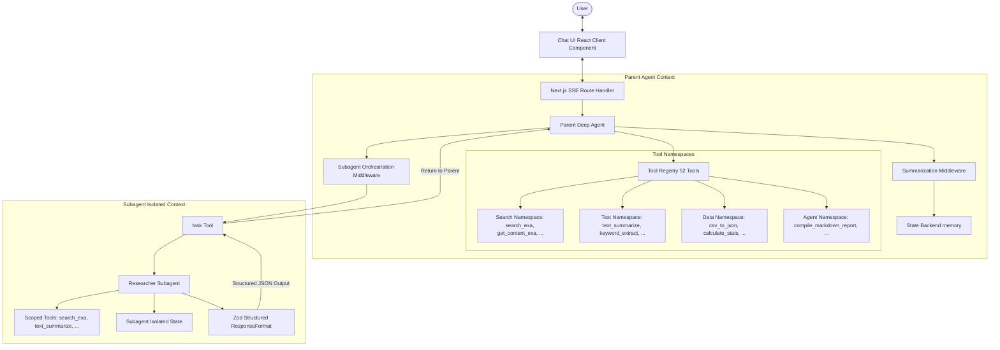

# Implementation Plan - Deep Research Agent

We are building a **Deep Research Agent** web application. The application will leverage `langchain` and `deepagents` (a LangGraph-based agent harness) to build an agent capable of multi-step research, tool composition, subagent orchestration, and long-horizon context retention.

## System Architecture

The following Mermaid diagram visualizes the flow of data, tool execution, and the context boundaries between the parent agent and the isolated subagent.

---

## User Review Required

> [!IMPORTANT]
> **API Package Installation**: We need to install `@langchain/openai` to build the OpenAI model instances in LangChain. We will use `pnpm` to install this.
>
> **Exa Search API Key**: Running the search tools requires an `EXA_API_KEY` and `OPENAI_API_KEY`. These keys must be placed in a `.env.local` file at the root.

---

## Proposed Changes

We will split the codebase into modular, single-responsibility files, ensuring **no file exceeds 150 lines** and using kebab-case (lowercase with hyphens) naming.

### 1. Configuration & Scaffolding

#### [NEW] [env.example](file:///c:/Desktop/job-research-agent/.env.example)
* Contains placeholders for `OPENAI_API_KEY` and `EXA_API_KEY`.

#### [NEW] [typed-errors.ts](file:///c:/Desktop/job-research-agent/lib/utils/typed-errors.ts)
* Typed error classes (`ToolValidationError`, `RateLimitError`, `LLMError`, `SubagentError`).

#### [NEW] [network-helpers.ts](file:///c:/Desktop/job-research-agent/lib/utils/network-helpers.ts)
* Retry utility with exponential backoff.
* Rate limiter to throttle external API calls.

#### [NEW] [observability-logger.ts](file:///c:/Desktop/job-research-agent/lib/utils/observability-logger.ts)
* Helper to log steps, tool execution, durations, and trace runs.

---

### 2. Tool namespaces (52 tools total, < 150 lines per file)

#### [NEW] [search-tools.ts](file:///c:/Desktop/job-research-agent/lib/tools/search-tools.ts)
* **Namespace**: `search`
* Contains 13 tools using Exa (`search_exa`, `get_content_exa`, `find_similar_exa`, `search_news`, `search_code`, `search_academic`, `search_by_domain`, `search_by_date`, `validate_url`, `extract_links`, `fetch_rss`, `get_domain_rank`, `list_search_engines`).

#### [NEW] [text-tools.ts](file:///c:/Desktop/job-research-agent/lib/tools/text-tools.ts)
* **Namespace**: `text`
* Contains 13 utility tools (`text_summarize`, `keyword_extract`, `sentiment_analyze`, `extract_emails`, `extract_urls`, `clean_whitespace`, `word_count`, `char_count`, `line_count`, `to_lowercase`, `to_uppercase`, `base64_encode`, `base64_decode`).

#### [NEW] [data-tools.ts](file:///c:/Desktop/job-research-agent/lib/tools/data-tools.ts)
* **Namespace**: `data`
* Contains 13 tools (`json_parse`, `json_stringify`, `csv_to_json`, `json_to_csv`, `calculate_stats`, `math_eval`, `date_format`, `date_diff`, `generate_uuid`, `generate_hash`, `url_encode`, `url_decode`, `random_number`).

#### [NEW] [agent-tools.ts](file:///c:/Desktop/job-research-agent/lib/tools/agent-tools.ts)
* **Namespace**: `agent`
* Contains 13 tools (`compile_markdown_report`, `create_markdown_table`, `verify_checklist`, `format_citations`, `generate_bullet_points`, `summarize_key_findings`, `validate_research_goal`, `append_to_file`, `create_draft_outline`, `assess_relevance`, `compare_texts`, `find_pattern`, `extract_metadata`).

---

### 3. Agent Assembly & Subagent Orchestration

#### [NEW] [researcher-agent.ts](file:///c:/Desktop/job-research-agent/lib/subagents/researcher-agent.ts)
* Defines the isolated `researcherSubAgent` spec (its own scoped toolset, specific system prompt, and a Zod structured `responseFormat`).

#### [NEW] [deep-research-agent.ts](file:///c:/Desktop/job-research-agent/lib/deep-research-agent.ts)
* Compiles the parent agent using `createDeepAgent` with all 52 tools, the subagent, and `createSummarizationMiddleware` for explicit context retention (triggering summarization after 15 messages and keeping the last 5).

---

### 4. Next.js Routing & SSE Endpoint

#### [NEW] [route.ts](file:///c:/Desktop/job-research-agent/app/api/chat/route.ts)
* Next.js Route Handler.
* Receives a prompt, triggers the agent, streams events (thinking logs, tool calls, tool results, subagent execution steps) to the client using Server-Sent Events (SSE).

---

### 5. Chat UI Components (< 150 lines per file)

#### [NEW] [chat-interface.tsx](file:///c:/Desktop/job-research-agent/app/components/chat-interface.tsx)
* Main client interface orchestrating state and the event stream source.

#### [NEW] [message-list.tsx](file:///c:/Desktop/job-research-agent/app/components/message-list.tsx)
* Renders user & assistant messages.

#### [NEW] [message-item.tsx](file:///c:/Desktop/job-research-agent/app/components/message-item.tsx)
* Renders a single message with markdown formatting.

#### [NEW] [reasoning-steps.tsx](file:///c:/Desktop/job-research-agent/app/components/reasoning-steps.tsx)
* Inline accordion showing tool calls, Exa searches, outputs, and subagent executions.

#### [NEW] [chat-input.tsx](file:///c:/Desktop/job-research-agent/app/components/chat-input.tsx)
* Input field with validation and loading indicator.

#### [MODIFY] [page.tsx](file:///c:/Desktop/job-research-agent/app/page.tsx)
* Standard Next.js server page rendering `ChatInterface`.

#### [MODIFY] [globals.css](file:///c:/Desktop/job-research-agent/app/globals.css)
* Custom Tailwind styling overrides for dark/light mode and transitions.

---

### 6. Testing & Evaluation Scaffolding

#### [NEW] [run-evaluation.ts](file:///c:/Desktop/job-research-agent/scripts/run-evaluation.ts)
* Script running the agent against specific scenarios to evaluate success rates, tool call counts, latency, and correctness.

#### [NEW] [unit-testing.test.ts](file:///c:/Desktop/job-research-agent/tests/unit-testing.test.ts)
* Tests helper utilities: exponential backoff, rate limiter, errors, and tool registers.

#### [NEW] [integration-testing.test.ts](file:///c:/Desktop/job-research-agent/tests/integration-testing.test.ts)
* Integration test that runs a mock research agent cycle with mocked tools to test subagent orchestration, tool composition, and message summarization.

---

## Verification Plan

### Automated Tests
* Run unit and integration tests using: `pnpm test` or a custom test runner script.
* Run the evaluation harness to assert long-horizon task completion (20+ tool calls) and correct structured results.

### Manual Verification
* Start the dev server: `pnpm dev`.
* Verify that the responsive layout works on mobile, tablet, and desktop viewports.
* Verify that the dark mode defaults correctly, and toggle light/dark modes.
* Interact with the chat interface, trigger research tasks, and monitor:
  1. The thinking/reasoning logs.
  2. Tool calls and outputs.
  3. Subagent spawning and nested execution steps.
  4. Summarization triggering (history offloading).
